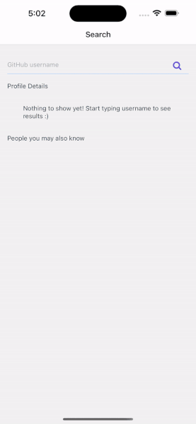

# Assignment for Speer Technologies React Native assessment

> **Features:**
>
> - [Based on my own boiletplate code](https://github.com/nmka55/rn_drawertabnav_boilerplate)

> - App has following features: Search by username, lists other users with matching usernames, see follower/following count, name, handle and their bio, see full profile

Timelog:

11/08 00:49 - started creating a project, code for an hour
11/08 11:14 - continued coding
11/08 15:34 - finished. Started committing to repo
11/08 15:34 - Changing readme
